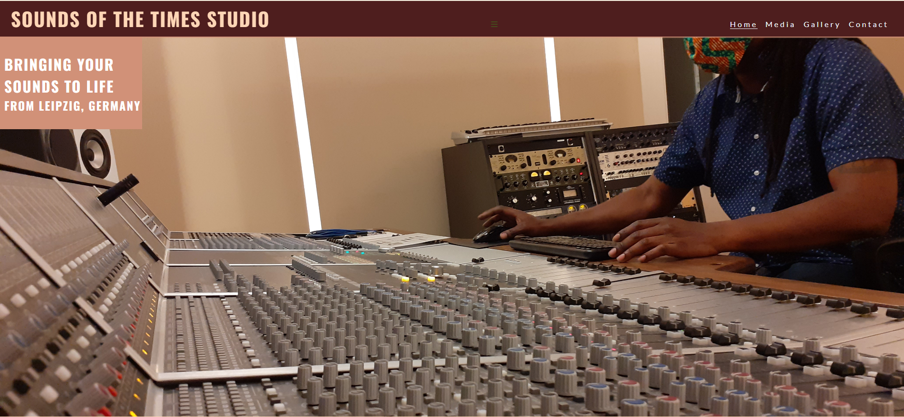
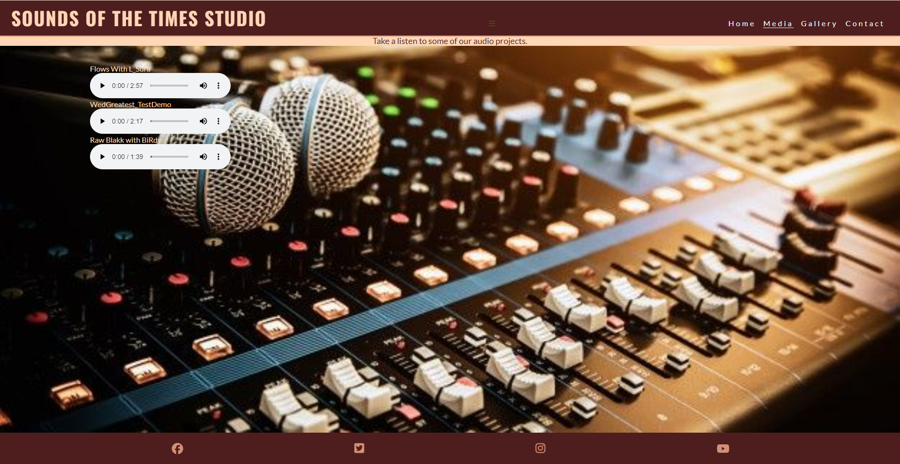
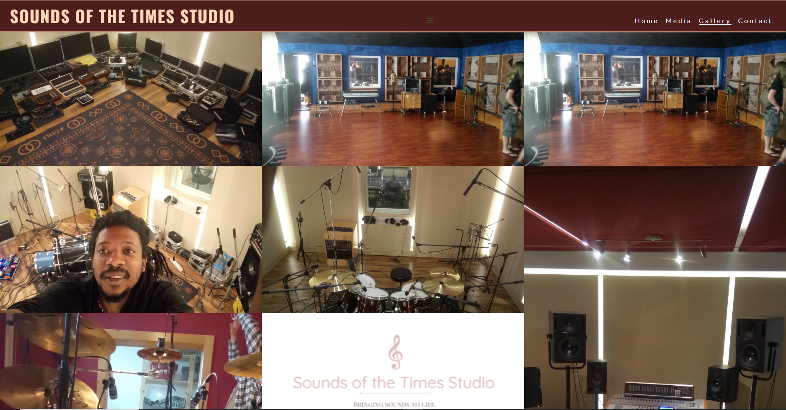
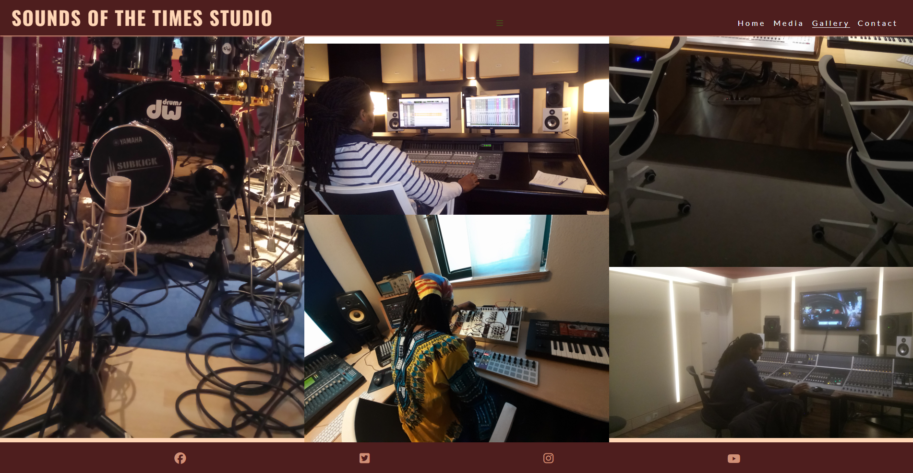
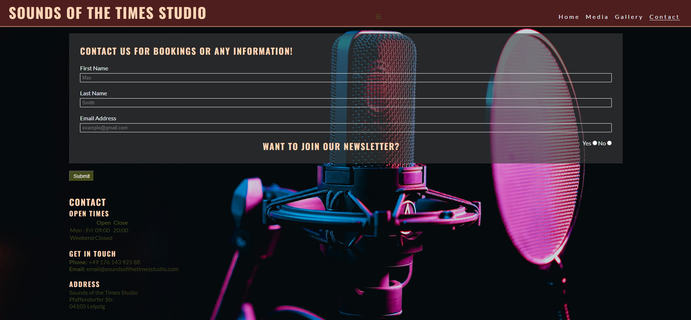

# Sounds of the Times Studio

Sounds of the times studio is a site that gives musicians in Leipzig and Germany, the opportunity to have their music to be produced in an industry standard music recording environment. This site will enable the musician to have a glimpse of what kind of equiptments we have, and also to listen to some of the music recorded here in our studios. They will also be able to ask for information and by entering some details, they will be contacted with the information they need, provided we have them. 

## Features

### Navigation Bar

Featured on all three pages, the full responsive navigation bar includes links to the Logo, Home page, Media, Gallery and Contact page and is identical in each page to allow for easy navigation.

This section will allow the user to easily navigate from page to page across all devices without having to revert back to the previous page via the ‘back’ button.

### The Home page

The Home page has two sections, the Home page image and the About Us section. This is an image with text overlay to allow the user to see exactly which location this site would be applicable to. 

The Home page image shows a quick preview of the Heritage analog sound mixer which is our most priced mixer and a world legend in the mixer world, and other equipents in the background.

#### About Us

This section tells the user about the Sounds of the Times Studio, what we do and experiences we have gathered so far. This should encourage the user to decide if they would like to use our services. 

It also features a photo of a sound technician micing a drum set.

#### The Footer

The footer section includes links to the relevant social media sites for Sounds of the Times Studio. The links will open to a new tab to allow easy navigation for the user.

The footer is valuable to the user as it encourages them to keep connected via social media

### Media

The media will provide the user with supporting music to hear what our final mixes sound like.This section is valuable to the user as they will be able to hear the genres of music we produce.

The background has an image of a mixer with two microphones connoting to recording and mixing.

### Gallery

The gallery will provide the user with supporting images to see how the recording studios look like.

This section is valuable to the user as they will be able to easily identify the types of equipments the studio has.

### The Contact Page

This page will allow the user to contact us for bookings or any other information they require. The user will be able specify if they would like to join our Newsletter or not. The user will be asked to submit their first and last names and email address.

### Features Left to Implement

In the future, a booking system will be added where the user would see a calendar with availables slots to book an appointment.

## Testing

